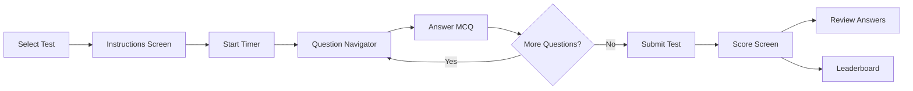

# AgriSeniorJuniorGuide — Implementation Plan

> **"From Farm to Lab — Your Complete ICAR JRF Command Center"**
> Production-grade EdTech platform · Vanilla HTML/CSS/JS · Zero-dependency · Static deployment

---

## Architecture Overview

### Tech Stack Decision

| Layer | Choice | Rationale |
|-------|--------|-----------|
| **Markup** | HTML5 semantic | SEO, accessibility, no transpilation |
| **Styling** | Vanilla CSS with custom properties | Full control, no build step, cascading design tokens |
| **Logic** | ES6+ JavaScript (modules) | Interactive sections, filters, assessment engine, modals |
| **Fonts** | Google Fonts CDN | DM Serif Display + DM Sans + JetBrains Mono |
| **Icons** | Inline SVGs | Zero dependency, crisp at any size, cacheable |
| **Images** | Generated via AI tool + SVG illustrations | No placeholder stock photos |
| **Deployment** | Static file hosting (Netlify/Vercel/GitHub Pages) | Just upload files |

### File Structure

```
Agri-juniorseniorguide/
├── index.html                  # Main landing page (all 10 sections)
├── css/
│   ├── variables.css           # Design tokens, CSS custom properties
│   ├── reset.css               # Modern CSS reset
│   ├── typography.css           # Font loading, type scale
│   ├── layout.css              # Grid system, containers, spacing utilities
│   ├── components.css          # Reusable component styles (cards, badges, buttons, modals)
│   ├── nav.css                 # Navigation (desktop + mobile drawer)
│   ├── hero.css                # Hero section + wheat animation
│   ├── courses.css             # Course catalog section
│   ├── assessment.css          # Assessment hub + test engine
│   ├── network.css             # Mentor network section
│   ├── topper-vault.css        # Topper insights section
│   ├── counseling.css          # Counseling timeline
│   ├── research.css            # M.Sc. research portal
│   ├── testimonials.css        # Testimonials section
│   ├── footer.css              # Footer styles
│   └── responsive.css          # All media queries consolidated
├── js/
│   ├── app.js                  # Main initialization, scroll behavior, nav logic
│   ├── courses.js              # Course filtering, rendering
│   ├── assessment.js           # Full assessment engine (timer, MCQ, scoring, leaderboard)
│   ├── network.js              # Mentor directory filtering, search, connect modal
│   ├── topper-vault.js         # Topper filtering, video modal
│   ├── counseling.js           # Step wizard interactions
│   ├── rank-advisor.js         # Seat allotment strategy engine
│   └── data.js                 # All static data (courses, mentors, questions, universities)
├── assets/
│   ├── images/                 # Generated images (hero illustration, university logos, etc.)
│   ├── icons/                  # SVG icon files (or inline in HTML)
│   └── fonts/                  # Local font fallbacks (optional, using CDN primarily)
├── pages/
│   ├── test.html               # Dedicated test-taking page (full assessment engine)
│   ├── course-detail.html      # Individual course detail / video player page
│   └── mentor-profile.html     # Full mentor profile page
├── manifest.json               # PWA manifest
├── sw.js                       # Service worker (basic offline shell)
├── robots.txt                  # Search engine directives
└── sitemap.xml                 # XML sitemap
```

---

## Component Architecture

```mermaid
graph TD
    A["index.html"] --> B["Navigation"]
    A --> C["Hero Section"]
    A --> D["Courses Section"]
    A --> E["Assessment Hub"]
    A --> F["Mentor Network"]
    A --> G["Topper Vault"]
    A --> H["Counseling Timeline"]
    A --> I["Research Portal"]
    A --> J["Testimonials"]
    A --> K["University Partners"]
    A --> L["Footer"]

    D --> D1["CourseCard component"]
    D --> D2["FilterBar component"]
    
    E --> E1["TestCard component"]
    E --> E2["CountdownTimer component"]
    E --> E3["NumericalZone card"]
    
    F --> F1["MentorCard component"]
    F --> F2["SearchBar component"]
    F --> F3["ConnectModal component"]
    
    G --> G1["TopperCard component"]
    G --> G2["VideoModal component"]
    
    H --> H1["StepWizard component"]
    H --> H2["SeatAllotment table"]
    H --> H3["RankAdvisor component"]

    B --> B1["DesktopNav"]
    B --> B2["MobileDrawer"]
```



---

## Data Models

All data is stored in `js/data.js` as JavaScript objects/arrays. No backend for v1 — data is hardcoded with realistic ICAR content.

### Course

```js
{
  id: "crop-physiology-crash",
  title: "Crop Physiology Crash Course",
  subject: "Crop Physiology",
  type: "CRASH_COURSE",        // CRASH_COURSE | FULL_SYLLABUS | LIVE_CLASS
  duration: "10 Days",
  instructor: "Dr. Ramesh Kumar",
  level: "Intermediate",       // Beginner | Intermediate | Advanced
  enrollmentCount: 1847,
  rating: 4.7,
  totalLectures: 24,
  thumbnail: "assets/images/crop-physiology.jpg",
  description: "...",
  liveDate: null               // ISO date for LIVE_CLASS type
}
```

### Test

```js
{
  id: "weekly-soil-science-5",
  title: "Soil Science — Unit Test 5",
  type: "WEEKLY",              // WEEKLY | GRAND | NUMERICAL
  subject: "Soil Science",
  questionCount: 30,
  durationMinutes: 45,
  scheduledDate: "2026-06-01T10:00:00+05:30",
  enrolledCount: 632,
  isLive: false
}
```

### Question (Assessment Engine)

```js
{
  id: "q-soil-042",
  testId: "weekly-soil-science-5",
  text: "Which of the following soil orders is characterized by a clay-enriched subsurface (argillic) horizon?",
  options: [
    { key: "A", text: "Entisols" },
    { key: "B", text: "Alfisols" },
    { key: "C", text: "Vertisols" },
    { key: "D", text: "Histosols" }
  ],
  correctKey: "B",
  explanation: "Alfisols are characterized by...",
  subject: "Soil Science",
  difficulty: "Medium",
  isNumerical: false
}
```

### MentorProfile

```js
{
  id: "mentor-priya-iari",
  name: "Dr. Priya Sharma",
  university: "IARI New Delhi",
  universityShort: "IARI",
  jrfRank: 58,
  yearCleared: 2024,
  specialization: "Plant Pathology",
  degree: "Ph.D. Scholar",
  isAvailable: true,
  avatarInitials: "PS",
  linkedinUrl: "#",
  bio: "..."
}
```

### CounselingStep

```js
{
  stepNumber: 1,
  title: "Result Declaration",
  icon: "clipboard-check",
  description: "What to do immediately after ICAR JRF results...",
  checklist: ["Download scorecard", "Verify roll number", ...],
  commonMistakes: ["Not saving the scorecard PDF", ...],
  downloadLabel: "Post-Result Checklist"
}
```

### University (for comparison table)

```js
{
  name: "IARI New Delhi",
  shortName: "IARI",
  programs: ["Plant Pathology", "Agronomy", "Genetics", ...],
  totalSeats: 180,
  researchStrength: "Excellent",
  stipend: "₹31,000/month + HRA",
  location: "New Delhi",
  rankCutoff: { general: 200, obc: 350, sc: 500 }
}
```

---

## Design System Implementation

### CSS Variables (variables.css)

All colors, typography, spacing, shadows, and radii from the master prompt will be defined as CSS custom properties on `:root`. This enables easy theming and consistent application.

### Typography Scale

| Token | Font | Weight | Size | Usage |
|-------|------|--------|------|-------|
| `--font-display` | DM Serif Display | 400 | 48px/40px/32px | h1, hero headline |
| `--font-heading` | DM Serif Display | 400 | 28px/24px/20px | h2, h3 section titles |
| `--font-body` | DM Sans | 400/500/700 | 16px/14px | Paragraphs, labels |
| `--font-mono` | JetBrains Mono | 500 | 14px/16px | Ranks, scores, timers, numbers |

### Spacing System

8px base grid: `--space-1: 8px` through `--space-12: 96px`

### Component Tokens

| Component | Border Radius | Shadow | Padding |
|-----------|---------------|--------|---------|
| Card | 8px | `0 1px 3px rgba(0,0,0,0.08), 0 4px 16px rgba(0,0,0,0.06)` | 24px |
| Button (primary) | 6px | none | 12px 24px |
| Button (ghost) | 6px | none | 12px 24px |
| Badge/Chip | 24px | none | 4px 12px |
| Input | 4px | none | 12px 16px |
| Modal | 12px | `0 8px 32px rgba(0,0,0,0.12)` | 32px |

---

## Page Sections — Build Plan

### 1. Hero Section
- Full-width section with cream background
- Animated wheat SVG illustration (CSS `@keyframes` — gentle sway)
- Headline in DM Serif Display, sub-headline in DM Sans
- Two CTA buttons: primary green filled + ghost outline
- Trust bar with university names as a horizontal list
- Stats strip with 4 metric boxes (counter-style numbers)

### 2. Courses Section
- Section title + filter bar (All / Crash Course / Full Syllabus / Live Class + subject dropdown)
- Responsive grid: 3 columns desktop → 2 tablet → 1 mobile
- Course cards with type badge, rating stars, enrollment count, CTA
- Live class cards get a pulsing "LIVE" dot + countdown timer

### 3. Assessment Hub
- Three category cards: Weekly Tests, Grand Tests, Numerical Agronomy Zone
- Upcoming test cards with countdown timers
- "Start Test" button opens `pages/test.html`
- Leaderboard preview (top 5) with rank, name, score, university

### 4. Mentor Network
- Search bar + filter chips (university, specialization, availability)
- Mentor cards in 3-column grid
- Each card: avatar circle with initials, name, university badge, AIR rank chip, specialization, connect button
- Connect button opens a modal with message form

### 5. Topper Vault
- 3-column video card grid
- Each card: video thumbnail, play overlay icon, name, AIR rank badge, university, year
- Click opens video modal with: embedded player area, timestamps sidebar, study routine card, recommended resources, quote pullout
- Filter bar: Subject, Rank Range, University, Year

### 6. Counseling Timeline
- Horizontal step wizard (desktop) → vertical (mobile)
- 5 connected steps with progress indicator
- Click each step to expand: description, checklist, common mistakes callout
- Below: Seat Allotment comparison table (scrollable on mobile)
- Rank advisor: input field for AIR rank → dynamically shows recommended universities

### 7. M.Sc. Research Portal
- 5 resource category cards with distinct icons
- Each card: icon, title, description, resource count, "Explore →" link
- Expandable accordion or sub-cards for sub-topics

### 8. Testimonials
- 3-column card layout with quote marks
- Student name, university tag badge, program
- Auto-rotating carousel on mobile (CSS scroll-snap)

### 9. University Partners
- Logo grid (auto-fill responsive)
- SVG/text-based university identifiers with colored backgrounds
- Subtle infinite scroll animation (CSS marquee effect)

### 10. Footer
- 4-column layout: About, Quick Links, Resources, Connect
- Newsletter signup input + button
- Social icons (LinkedIn, YouTube, Telegram, Instagram)
- Legal disclaimer, copyright

---

## Assessment Engine — Detailed Plan

The assessment engine is the most complex interactive feature. It lives on `pages/test.html` and is powered by `js/assessment.js`.

### Flow



### Key Components

1. **Timer** — Countdown from test duration, warning at 5 min (turns red), auto-submit at 0
2. **Question Renderer** — Displays question text, 4 options (A/B/C/D), option highlight on select
3. **Question Navigator** — Grid of numbered circles: green (answered), gray (unanswered), orange (marked for review)
4. **Numerical Questions** — Same MCQ format but with calculation-based stems (fertilizer dose, seed rate, etc.) + detailed step-by-step solution
5. **Score Screen** — Total score, percentage, subject-wise breakdown bar chart, weak area highlight, percentile rank (simulated)
6. **Answer Review** — Walk through each question showing selected vs. correct answer with explanation
7. **Leaderboard** — Table: Rank, Name, University, Score, Time Taken

---

## Responsive Breakpoints Strategy

| Breakpoint | Target | Layout Changes |
|------------|--------|----------------|
| `320px` | Small phones | Single column, stacked nav, compact cards |
| `480px` | Large phones | Single column, slightly wider cards |
| `768px` | Tablets | 2-column grids, side-by-side stats |
| `1024px` | Small desktop | 3-column grids, full nav visible |
| `1280px` | Desktop | Max-width container (1200px), full layout |
| `1440px+` | Ultrawide | Centered with max-width, generous whitespace |

**Mobile-first approach:** Base styles target 320px, media queries add complexity upward.

---

## Accessibility Plan

- All images: `alt` attributes with descriptive text
- Interactive elements: `aria-label`, `role`, proper `tabindex`
- Focus states: visible outline (green) on all focusable elements
- Keyboard navigation: Tab through nav, Enter to activate, Escape to close modals
- Color contrast: All text meets WCAG AA (4.5:1 minimum)
- Semantic HTML: `<header>`, `<nav>`, `<main>`, `<section>`, `<article>`, `<footer>`
- Skip-to-content link (hidden until focused)
- ARIA live regions for timer countdown and score announcements

---

## SEO & Deployment

### Meta Tags
- `<title>`, `<meta description>`, Open Graph tags, Twitter Card tags
- JSON-LD structured data (EducationalOrganization + Course schema)
- Canonical URL

### PWA
- `manifest.json` with app name, icons, theme color (#2E7D32), display: standalone
- Basic service worker for offline shell caching

### Static Deployment
- Upload entire folder to Netlify/Vercel/GitHub Pages
- No build step needed — files served as-is
- Add `_redirects` or equivalent for SPA-like behavior if needed

---

## Phased Build Order

### Phase 1 — Foundation (CSS design system + layout)
1. `css/reset.css` — Modern CSS reset
2. `css/variables.css` — All design tokens
3. `css/typography.css` — Font imports, type scale
4. `css/layout.css` — Container, grid, spacing utilities
5. `css/components.css` — Buttons, cards, badges, chips, modals, inputs
6. Generate hero illustration image

### Phase 2 — Core Shell
7. `index.html` — Full HTML structure (all 10 sections)
8. `css/nav.css` — Navigation styles
9. `js/app.js` — Nav scroll behavior, mobile drawer, smooth scroll
10. `css/footer.css` — Footer styles

### Phase 3 — Content Sections
11. `js/data.js` — All static data (courses, mentors, tests, questions, universities, testimonials)
12. `css/hero.css` + wheat SVG animation
13. `css/courses.css` + `js/courses.js` — Course section with filtering
14. `css/assessment.css` — Assessment hub on landing page
15. `css/network.css` + `js/network.js` — Mentor directory with search/filter
16. `css/topper-vault.css` + `js/topper-vault.js` — Topper insights
17. `css/counseling.css` + `js/counseling.js` — Counseling timeline + rank advisor
18. `css/research.css` — Research portal cards
19. `css/testimonials.css` — Testimonials section

### Phase 4 — Assessment Engine
20. `pages/test.html` — Dedicated test page
21. `js/assessment.js` — Timer, MCQ engine, scoring, leaderboard

### Phase 5 — Polish & Deploy
22. `css/responsive.css` — All media queries
23. `manifest.json` + `sw.js` — PWA support
24. `robots.txt` + `sitemap.xml`
25. Final cross-device testing mentally at all breakpoints
26. Generate any remaining images (university logos, thumbnails)

---

## User Review Required

> [!IMPORTANT]
> **Single-page vs. Multi-page:** The plan uses `index.html` as a long-scrolling landing page with all 10 sections, and separate pages (`pages/test.html`, `pages/course-detail.html`) for deep-dive experiences. Is this the right approach, or would you prefer every module as its own page?

> [!IMPORTANT]
> **Content Scope for v1:** The data in `js/data.js` will be hardcoded with ~8 realistic courses, ~12 mentors, ~6 toppers, ~30 sample MCQ questions (including numerical agronomy), 5 counseling steps, and 8 universities. This is enough to demonstrate every feature fully. Expand in v2 with a backend. Sound good?

> [!IMPORTANT]
> **Image Generation:** I'll generate key images using the AI image tool (hero illustration with wheat/agriculture theme, placeholder thumbnails for courses and toppers). University "logos" will be CSS-styled text badges rather than actual trademarked logos to avoid IP issues. Acceptable?

---

## Open Questions

> [!NOTE]
> **Video Embeds:** For the Topper Vault and Course detail pages, should the video player show a styled placeholder UI (play button over thumbnail), or do you have actual YouTube video IDs to embed?

> [!NOTE]
> **Authentication UI:** The nav shows Login/Join buttons. Should I build the login/signup modal UI (frontend only, no backend auth), or just have them as placeholder buttons for v1?

> [!NOTE]
> **Dark Mode:** The master prompt specifies a white/cream/green palette. Do you want a dark mode toggle for v2, or should I skip it entirely?
